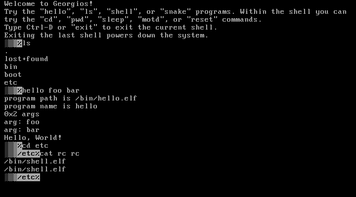

# Georgios

Georgios (Greek for George, said like *GORE-GEE-OS*) is an operating system I'm
making for fun which currently targets i386/IA-32. The purpose of this project
is to serve as a learning experience.

Georgios is so simplistic right now the most impressive application is a snake
clone. This is probably going to be case forever until applications can be
ported.

## Building

Building Georgios requires a Unix-like environment with:
- [Zig](https://ziglang.org/) 0.8.1
- Python 3
- GRUB2
  - Requires i686 Support (`grub-pc-bin` package on Ubuntu)
- xorriso (`xorriso` package on Ubuntu)

Georgios can be built as a bootable ISO (called `georgios.iso`) by running
`make`. If installed, QEMU and Bochs can be run by running `make qemu` or `make bochs`
respectively. On Ubuntu Bochs requires `apt-get install bochs bochsbios
bochs-sdl bochs-x vgabios`.

For the moment it assumes the existence of an IDE disk with certain files on
it.

## Resources Used

- [OSDev Wiki](http://wiki.osdev.org/)
    - Very popular, fairly large set of resources in one place, but rough
      or just plain unhelpful in many places.
- [The little book about OS development](https://littleosbook.github.io/)
    - Polished, but limited intro into x86 OS development. Provided me with
      the initial start.
- [Intel x86 Software Development Manuals](https://software.intel.com/en-us/articles/intel-sdm)
- [xv6](https://github.com/mit-pdos/xv6-public)
- [The Design and Implementation of the 4.4 BSD Operating System](https://www.amazon.com/Implementation-Operating-paperback-Addison-wesley-Systems/dp/0132317923)
- [FYSOS: Media Storage Devices](https://www.amazon.com/dp/1514111888/)
